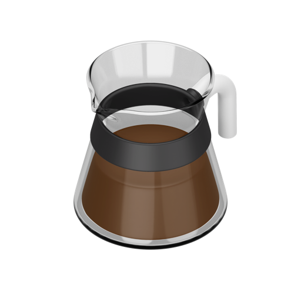
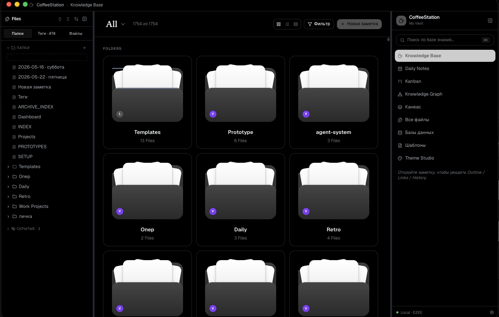
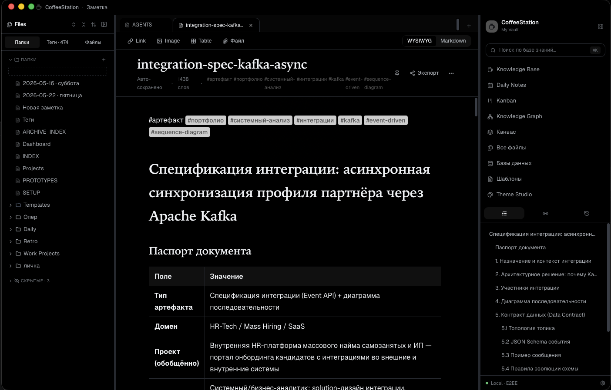
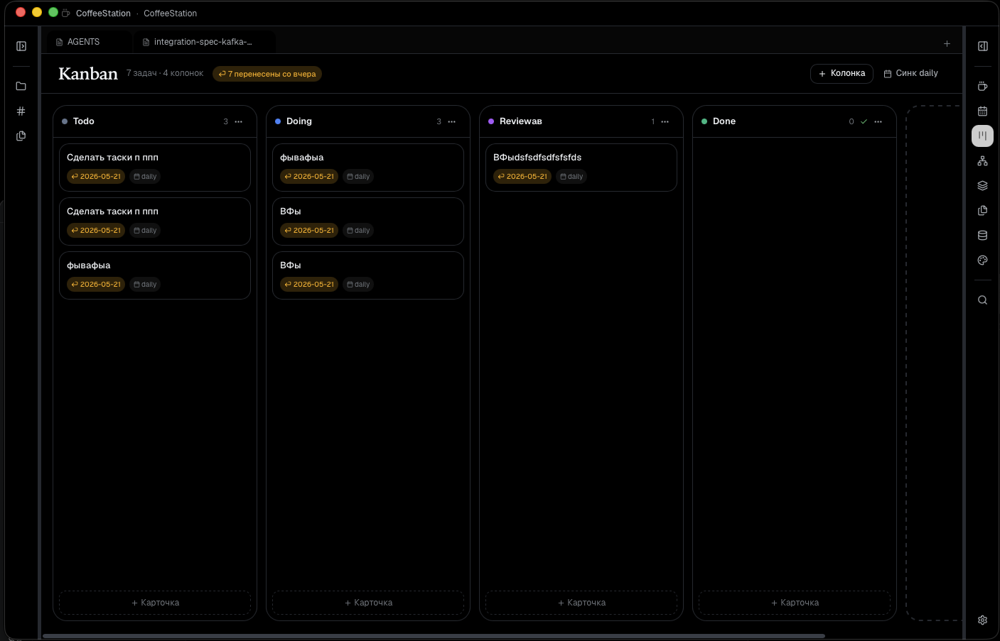
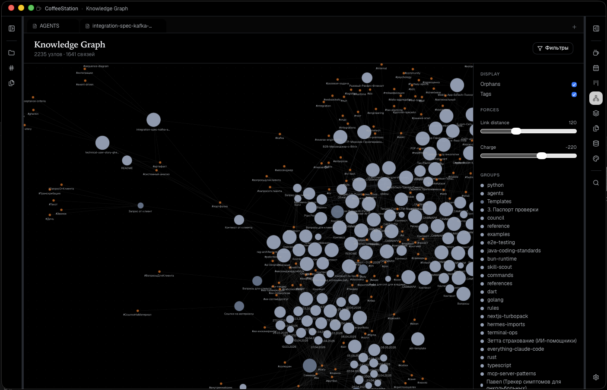
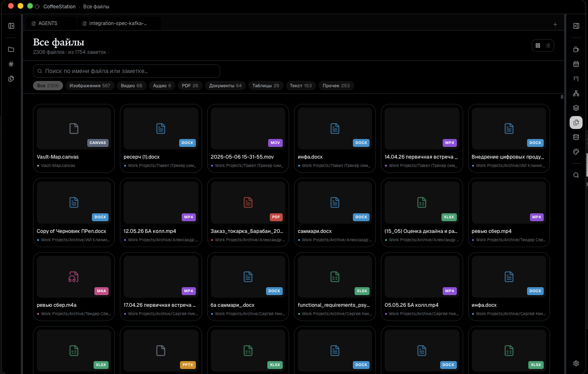
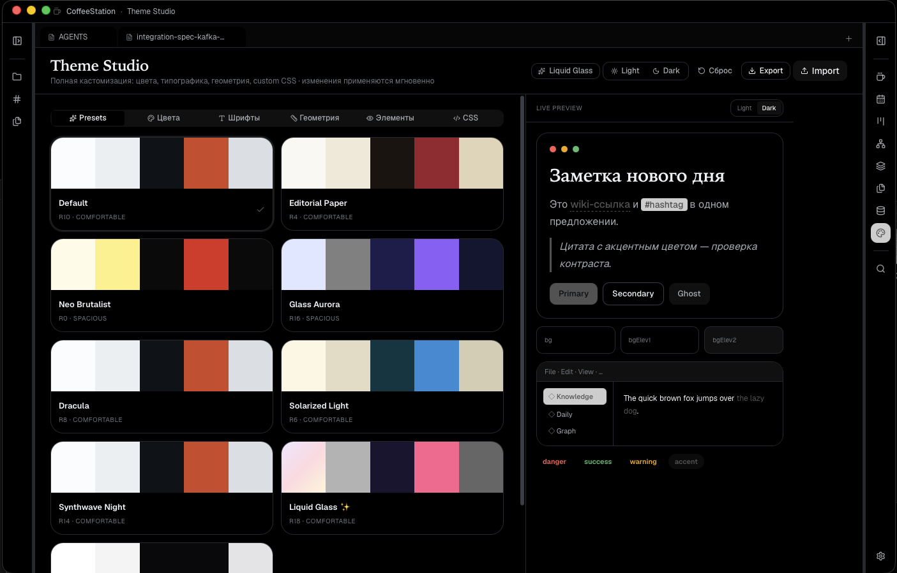

<div align="center">



# CoffeeStation

**Local-first personal knowledge management — built for people who actually use their notes.**

A native desktop PKM with notes, daily logs, kanban, knowledge graph, file vault, end-to-end encrypted GitHub sync, and a theme studio. Your data lives on your disk in plain Markdown — no cloud lock-in, no telemetry, no subscriptions.

[Русская версия →](README.ru.md) · [Download](#install) · [Build from source](#build-from-source) · [Roadmap](#roadmap)


</div>

---

## Why CoffeeStation

Most PKM tools force a trade-off. Obsidian is local but feels like 2012. Notion is beautiful but lives on someone else's server. Logseq is powerful but unfamiliar. CoffeeStation tries the third path: **native app speed, Markdown source-of-truth on your disk, Notion-grade editing, and modern visual polish** — all while staying offline-first and optionally syncing through your own GitHub repo with end-to-end encryption.

It's a single binary. No accounts. No servers. Your vault is a folder.

## Screenshots

<table>
  <tr>
    <td></td>
    <td></td>
  </tr>
  <tr>
    <td align="center"><b>Knowledge base</b> — sortable grid of every note</td>
    <td align="center"><b>Editor</b> — TipTap-based WYSIWYG with Markdown mode</td>
  </tr>
  <tr>
    <td></td>
    <td></td>
  </tr>
  <tr>
    <td align="center"><b>Kanban</b> — drag cards, daily-note integration</td>
    <td align="center"><b>Knowledge graph</b> — your wikilinks as a force-directed graph</td>
  </tr>
  <tr>
    <td></td>
    <td></td>
  </tr>
  <tr>
    <td align="center"><b>File vault</b> — preview MP4/PDF/XLSX/DOCX inline</td>
    <td align="center"><b>Theme studio</b> — OKLCH color picker, live preview</td>
  </tr>
</table>

## Features

### Writing
- **WYSIWYG editor** built on TipTap with Markdown round-trip — heading, lists, tables, code blocks with syntax highlighting, task lists, callouts, mentions, wikilinks (`[[Note name]]`) and `#tags`
- **Markdown mode** for purists — toggle per note
- **Outline panel** with click-to-scroll
- **Browser-style tabs** for open notes
- **Daily notes** that show up in Kanban automatically

### Organization
- **Folder tree** with drag-and-drop, multi-select (Cmd/Ctrl-click, Shift-click range), hide/show, per-folder colors
- **Mac-style folder cards** with file thumbnails
- **Right-click → New note here** to drop notes into the folder you mean
- **Three placement modes for new notes** (vault root / same folder as current / specific folder) — same model as Obsidian
- **Kanban board** with custom columns, priorities, daily-note pull-in
- **Knowledge graph** — your wikilinks rendered as an interactive force-directed graph
- **Database views** — tables, filters, sorts on top of notes

### File vault
- All your **MP4, MOV, MP3, PDF, PNG, SVG, JPEG, XLSX, DOCX, TXT** files live alongside notes
- **Inline viewers/editors** — video and audio stream via Tauri asset protocol; PDFs render in-app; spreadsheets are editable via SheetJS; DOCX preview via mammoth
- **File extension chips** for at-a-glance file type

### Sync
- **GitHub Device-Flow OAuth** — no manual PATs to manage
- **Git LFS** baked in for large binaries (MP4, PSD, etc.) so they go in the same repo, not into some separate blob store
- **Event-driven sync** — push on window blur, pull on focus, push on idle (each independently toggleable)
- **End-to-end encryption** (XChaCha20-Poly1305 + X25519 + Argon2id) so the server only ever sees ciphertext
- **Unobtrusive sync indicator** in the bottom-left corner

### Look & feel
- **Theme Studio** with OKLCH color tokens, live preview, exportable theme JSON
- **Liquid Glass** mode (macOS-style translucent surfaces) as an exclusive toggle
- **Light / Dark / System** theme
- **Resizable panels** with imperative collapse
- Custom typography (serif headings + system sans body)

### Privacy & ownership
- **100% local-first** — IndexedDB is the source of truth; the on-disk Markdown mirror is the export
- **No telemetry, no analytics, no phone-home**
- **Your vault is just a folder** — point it at your existing Obsidian vault and it just works

## Install

### macOS
1. Grab the latest `CoffeeStation_<version>_aarch64.dmg` from [Releases](https://github.com/Arti-Ko/CoffeeStation/releases)
2. Open the DMG, drag CoffeeStation to `/Applications`
3. First launch: right-click → Open (unsigned build, macOS Gatekeeper will warn once)

> **«Приложение повреждено и не может быть открыто»** — macOS вешает quarantine-атрибут на всё скачанное из браузера, а у нас бесплатная ad-hoc подпись (без покупки Apple Developer ID за $99/год). Снимай атрибут одной командой и запускай:
> ```bash
> xattr -dr com.apple.quarantine /Applications/CoffeeStation.app
> ```

> **Apple Silicon** only for now. Intel build (`x86_64-apple-darwin`) is a one-command rebuild — open an issue if you need one.

### Windows
1. Grab the latest `CoffeeStation_<version>_x64-setup.exe` from [Releases](https://github.com/Arti-Ko/coffeestation_lite/releases)
2. Run the installer. It's an NSIS installer — pick install path, optionally create desktop shortcut, done
3. Launch from Start menu

## Build from source

### Prerequisites
- **Node 20+** and **pnpm 9+** (or npm/yarn)
- **Rust 1.77+** (install via [rustup](https://rustup.rs))
- **Tauri prerequisites** for your platform — see [tauri.app/start/prerequisites](https://tauri.app/start/prerequisites/)

### Steps
```bash
git clone git@github.com:Arti-Ko/coffeestation_lite.git
cd coffeestation_lite/app
pnpm install

# Dev (hot-reload, native window)
pnpm tauri:dev

# Production .dmg / .app (macOS)
pnpm tauri:build

# Production .exe / NSIS installer (Windows)
pnpm tauri:build:win
```

Artifacts land in `app/src-tauri/target/release/bundle/`.

## Tech stack

| Layer | Tech |
|---|---|
| Desktop shell | [Tauri 2](https://tauri.app/) + Rust 1.77 |
| UI | [Next.js 16](https://nextjs.org/) (static export) + React 19 + Tailwind v4 |
| Editor | [TipTap 3.x](https://tiptap.dev/) (ProseMirror) |
| Local storage | [Dexie](https://dexie.org/) (IndexedDB) |
| Drag-and-drop | [@dnd-kit](https://dndkit.com/) + react-resizable-panels v4 |
| Spreadsheets | [SheetJS](https://sheetjs.com/) |
| DOCX preview | [mammoth.js](https://github.com/mwilliamson/mammoth.js) |
| Crypto | [libsodium](https://libsodium.gitbook.io/) (E2EE) |
| Sync | git + git-lfs via shell-out |

## Project layout

```
CoffeeStation/
├── app/                    # The Tauri app
│   ├── src/                # Next.js + React UI
│   │   ├── components/
│   │   │   ├── shell/      # Top-level shell: tabs, panels, sidebar
│   │   │   ├── views/      # Routed views (note, kanban, graph, etc.)
│   │   │   ├── editor/     # TipTap editor + custom nodes
│   │   │   └── files/      # File viewers
│   │   └── lib/
│   │       ├── db/         # Dexie schema + helpers
│   │       ├── desktop/    # Tauri-bridged paths, FS, vault scanning
│   │       ├── sync/       # GitHub OAuth, push/pull, LFS
│   │       └── crypto/     # E2EE
│   └── src-tauri/          # Rust backend
│       └── src/lib.rs      # All Tauri commands
├── clipper/                # Chrome web-clipper extension
├── docs/                   # Screenshots + docs
└── .github/workflows/      # CI / release pipeline
```

## Roadmap

Done:
- Notes, folders, tags, wikilinks
- TipTap WYSIWYG + Markdown mode
- Kanban with daily-note integration
- Knowledge graph
- File vault with inline viewers
- GitHub Device-Flow + LFS + E2EE
- Theme studio (OKLCH)
- macOS .dmg + Windows .exe builds

Planned:
- iPad companion (Tauri mobile when stable)
- Plugin API
- Multi-vault switcher
- Smarter graph (filter by tag, time window)
- Quick-capture global hotkey

## Contributing

PRs welcome. Before submitting:
1. `pnpm tsc --noEmit` clean
2. `pnpm tauri:build` clean
3. Manually test the feature in the native window (UI bugs slip past type checks)

Style: follow what's already in `app/src/` — Tailwind utility classes, OKLCH tokens, small files, `cn()` for conditional classes.

## License

[MIT](LICENSE) © [Arti-Ko](https://github.com/Arti-Ko)

---

<sub>Built with Tauri, Rust, Next.js, and a lot of espresso.</sub>
